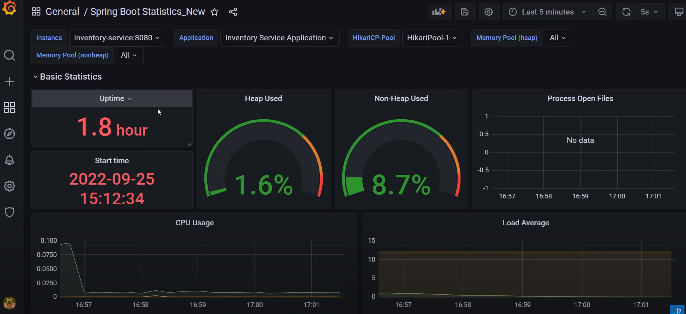
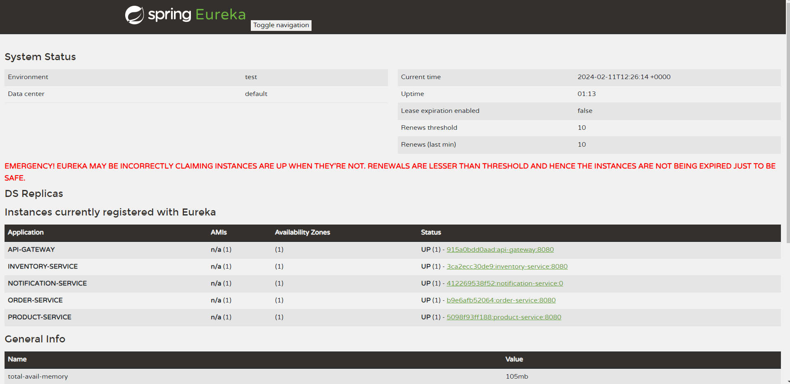
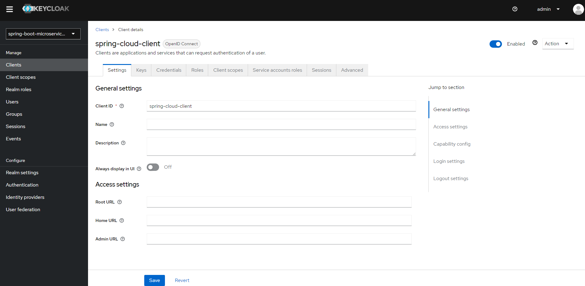
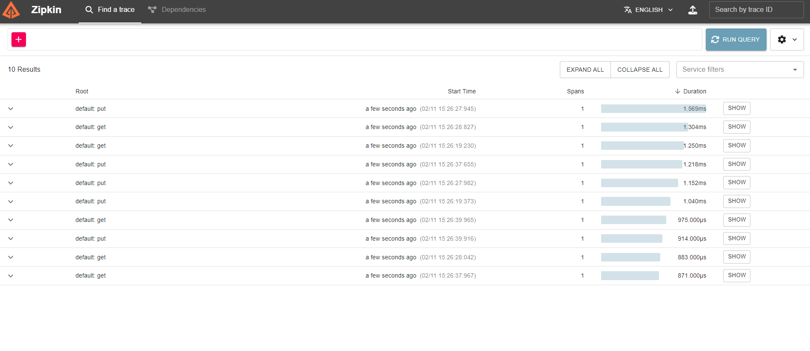
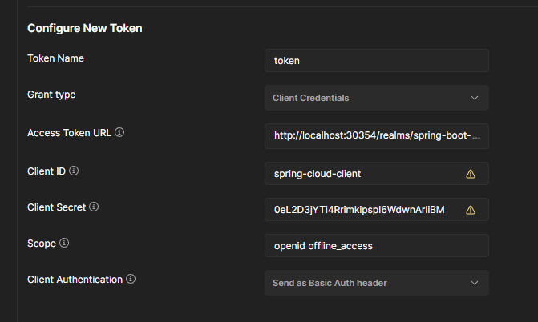
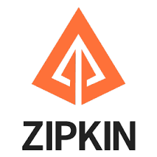
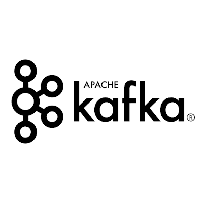
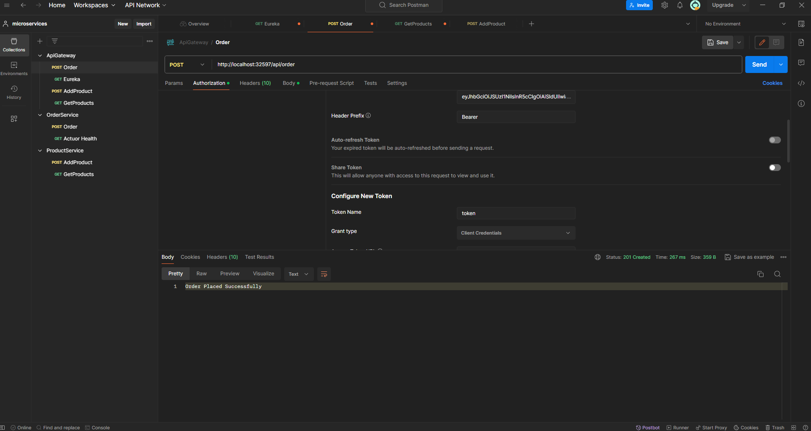

# Spring-Boot-Microservices-Project

In this project, a microservice architecture is utilized, consisting of 16 modules.

At its core, the project encompasses operations such as adding products, viewing products, checking product inventory, and placing product orders within an e-commerce platform. These operations involve asynchronous and synchronous tasks, logging activities, and various other processes.

Feel free to ask if you have any further questions or need additional information!


## Features

- Grafana and Prometheus



- Eureka:



- Keycloak:



-Zipkin:




  
## Distribution

1- Download or clone the project files.

2- Download Docker and setup.

3- Running the Files:

```terminal
  mvn build
```

```terminal
  mvn spring-boot:run
```

Configure New Token:

First navigate to "localhost:KeyCloakPORT" (replace PORT with the Keycloak port number) in your browser. Then, select "spring-boot-microservices" as the Realm. Proceed to the "Client" section and choose "spring-cloud-client" from the list. Navigate to the "Credentials" section and copy the "Client Secret":


Use your client secret:


You are ready to go!


## Technologies

**Language:** Bash / Shell Scripting

**Technologies:** - Docker and Kubernetes

**Language:** Spring Boot

**Technologies:** -Lombok -Actuator -Webflux -Crypto -Gateway


**Databases:** -MongoDB -MySql -Circuitbreaker


**Cloud computing technologies** Grafana, Prometheus


**Performance analysis and monitoring technology** Zipkin



**Service discovery technology** Netflix Eureka


**Security technology** Keycloak


**Data streaming technologies**




## API Usage

!!! For api key usage please read Distribution part.

#### AddProduct

```http
  POST /api/product
```

| Body | Tip     | Açıklama                |
| :-------- | :------- | :------------------------- |
| `name` | `String` | **Required** . |
| `description` | `String` | **Required** . |
| `price` | `Int` | **Required** . |


| Headers | Type     | Description               |
| :-------- | :------- | :------------------------- |
| `Authorization` | `Bearer:{{access_token}}` | **Required** . Your API key. |

#### Order

```http
  POST /api/order
```

| Body | Type     | Description               |
| :-------- | :------- | :------------------------- |
| `skuCode` | `String` | **Required** .  |
| `price` | `BigDecimal` | **Required** . |
| `quantity` | `Int` | **Required** . |


| Headers | Type     | Description                |
| :-------- | :------- | :------------------------- |
| `Authorization` | `Bearer:{{access_token}}` | **Required** . Your API key. |


```http
  GET /api/product
```

| Headers | Tip     | Açıklama                |
| :-------- | :------- | :------------------------- |
| `Authorization` | `Bearer:{{access_token}}` | **Required** . Your API key. |


## Tests

Postman Tests



  
## Related projects

You can take a look at the Microservices Project:

Java Spring Microservices Project Docker and Kubernetes [Java Spring Microservices Project Docker and Kubernetes]( https://github.com/Berko01/Spring-Boot-Microservice-Project)


  
## Extracted Lessons

Important knowledge has been gained about the technologies used in microservice development.

Information about using and configuring Kafka technology with containers.

Understanding the usage of Keycloak technology, including obtaining tokens from Keycloak using Postman.

Usage and configuration of Prometheus and Grafana.

Coding and configuration of Discovery Server with Netflix Eureka.

Development of the API Gateway module.

Significant gains in understanding asynchronous and synchronous processes.

Communication between microservices.
## Programmers

- [@Berko01](https://github.com/Berko01) development.

- [@ProgrammingTechie](https://www.youtube.com/watch?v=mPPhcU7oWDU&t=9072s) this is the resource of project. I learned and coded the project from here, and I added my improvements.

